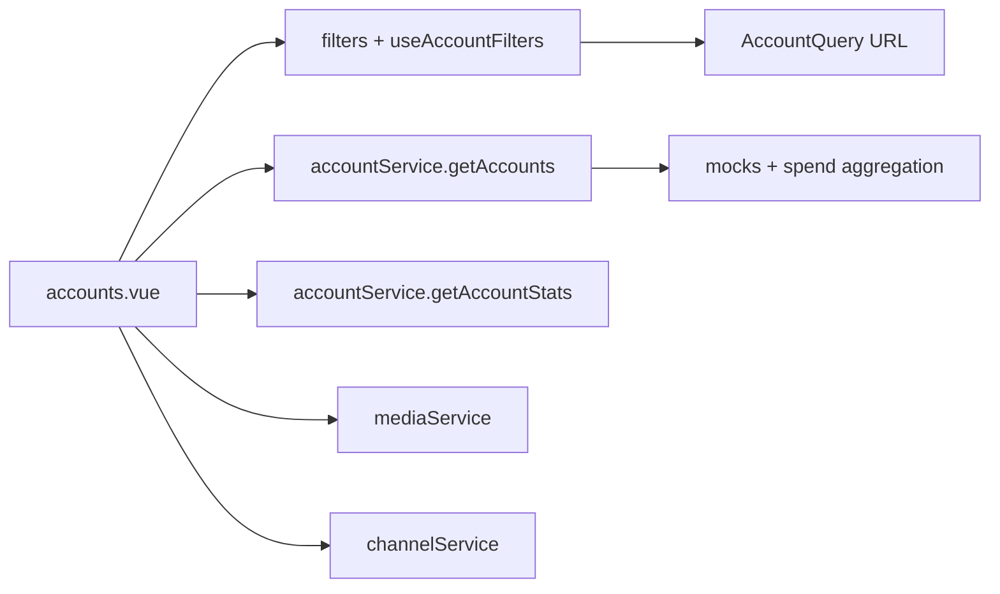

# Phase 2 — Account Center / All Accounts

## 定位澄清（以 phase_one.txt 为准）

| 来源 | “Phase 2” 含义 | 本阶段采用 |
|------|----------------|------------|
| [phase_one.txt](phase_one.txt) L62 / 结尾 | **Account Center — All Accounts** | **采用** |
| [plan.md](plan.md) L108 | PostgreSQL Schema | 延后（对应 plan STEP 16+） |
| [plan.md](plan.md) L1703 STEP 2 | Account Center — All Accounts | 与 phase_one 一致，作页面范围参考 |

Phase 1 已交付：`app/domain/**`、`app/mocks/**`、`app/services/**`、`components/filters/**`、`useAccountFilters`。  
Phase 2 **只做**全部账户工作台接线与 UI；**不做** Account Pool、Demand Scheduling、独立 Detail 页、PostgreSQL、真实 Media API。

## 当前缺口

主战场：[app/pages/accounts.vue](app/pages/accounts.vue)

- 仍 `useFetch('/api/accounts|teams|members')` + `~/types`
- 客户端全量 `filter`（违反 server-side 思维）
- Media 写死 Meta/Google/TikTok；旧状态 `pending|allocated|...`
- 列模型缺 Platform Asset / Manager / Spend Limit / Remaining / Period Spend
- Transfer/Recycle 直接改本地旧对象

Phase 1 可直接消费、基本不改：

- [app/services/accounts/mock.ts](app/services/accounts/mock.ts)
- [app/composables/useAccountFilters.ts](app/composables/useAccountFilters.ts)
- [app/components/filters/*](app/components/filters/)
- [app/services/media/mock.ts](app/services/media/mock.ts)、[channels/mock.ts](app/services/channels/mock.ts)、[teams/mock.ts](app/services/teams/mock.ts)

## 范围：做 / 不做

**做**

1. 列表数据改为 `accountService.getAccounts(query)` → `PagedResponse<AdAccountListItem>`
2. 统计改为 `getAccountStats(query)`（替代仅 badge 本地计数）
3. 筛选接线：`EntitySearch` + `QuickFilter` + `AdvancedFilterDrawer` + `ActiveFilterChips` + `useAccountFilters`（URL 同步、改筛重置 page）
4. Media/Channel 选项来自 `mediaService` / `channelService`（含 Snapchat）
5. 状态/归属枚举切到 domain：`AVAILABLE|ASSIGNED|...`、`INTERNAL|EXTERNAL`
6. 表格列按 phase_one §63 + list read model（见下）
7. Detail 仍用 **Modal**（不是独立页）；Transfer/Recycle 保留 UI，调用 toast 说明正式流转属后续 STEP，**禁止**再写旧 `pending` 本地 mutation
8. 分页 UI（page / pageSize）

**不做**

- 独立 Account Detail 路由页、Account Pool、Demand Scheduling
- 正式 `transferAccount` / `recycleAccount` 持久化（可在 service 留 stub，不落业务）
- 删除 `server/api/accounts.ts` 或旧 `~/types`（兼容其他旧页）
- 改 Nuxt UI / 路由一级导航架构；不建 DB

## 表格列（phase_one §63 优先于 plan §25.1）

固定消耗列：

- Spend Limit
- Amount Spent（Lifetime Media Spend，**不含**服务费）
- Remaining Limit（无 limit 显示 `—`，禁止 `$0`）

动态一列：**Period Spend**，页头 Period Selector：`Today | 7D | 30D | Custom`

- Today/7D/30D：用 list item 的 `todaySpend` / `spend7d` / `spend30d`
- Custom：把 `spendRange` 写入 `AccountQuery`，用返回的 `selectedPeriodSpend`

其余展示列（对齐 `AdAccountListItem`）：

- externalAccountId / accountName
- media / channel / platformAsset（按 `typeName` 动态 label，如 BM/MCC）
- timezone / serviceFeePolicy（Rate）
- product + ownership + customer（外接展示「外接 · Alpha」）
- team / member / manager（Member ≠ Manager）
- assetStatus / mediaStatus（apiAccess 可次要展示）
- lastSpendAt / receivedAt / note（有备注可图标或截断）

主操作：`Transfer` + `More`（Detail / Recycle；Change Product/Manager/Disable 可灰显「后续」）

## 实现步骤

1. **重写 [accounts.vue](app/pages/accounts.vue) 数据层**  
   - `const { query, setFilters, ... } = useAccountFilters()`  
   - `watch`/`computed` 调 `accountService.getAccounts(query)`、`getAccountStats(query)`  
   - 去掉三条 `/api/*` 与本地 `filteredAccounts`

2. **组装筛选工具栏**  
   - 接四个 filter 组件；Quick：媒体 / 资产状态 / 产品归属  
   - Advanced：已有 drawer 字段 + 按需补 team（用 `teamService.getTeams()`）  
   - Period Selector 独立控件（可新建 `components/accounts/SpendPeriodSelect.vue`）

3. **表格 + 分页**  
   - 列绑定 `AdAccountListItem`；金额 `formatCurrency`  
   - `UPagination` ↔ `query.page` / `pageSize`

4. **弹窗收敛**  
   - Detail：只读展示 list item / `getAccountById`  
   - Transfer/Recycle：表单可用 `teamService` 下拉，提交仅 toast + 关闭（不污染 mock）

5. **验收对照**  
   - Snapchat 出现在媒体筛选项且列表可出 `acc-snap-1`  
   - keyword=`123456` 能搜到挂 BM 的账户  
   - 刷新 URL 筛选不丢；改筛 page→1  
   - CASE E 行：limit 50k / spent 20k / remaining 30k；Period=7D 显示 4200  
   - 「已花费」≠ 含服务费  
   - 无硬编码 `Meta|Google|TikTok` union

6. **收尾**  
   - 对本页跑 lint/typecheck 相关错误；不全量修旧页  
   - 输出简短 Phase 2 Completed 说明 + 建议 Phase 3（Account Detail）只出计划

## 关键文件

| 动作 | 路径 |
|------|------|
| 大改 | [app/pages/accounts.vue](app/pages/accounts.vue) |
| 可选新建 | `app/components/accounts/SpendPeriodSelect.vue`（及必要时拆 Table/Modals） |
| 只读接线 | services / filters / useAccountFilters / domain |
| 不动 | `server/api/**`、`app/types/index.d.ts`、其他业务页 |

## 风险

- 旧页 typecheck 错误较多：Phase 2 只保证 accounts 新路径干净  
- Mock 账户数量少：分页仍应实现，便于后续扩数据  
- Transfer UI 若仍写本地状态易回退旧枚举：明确 stub 策略避免回归
