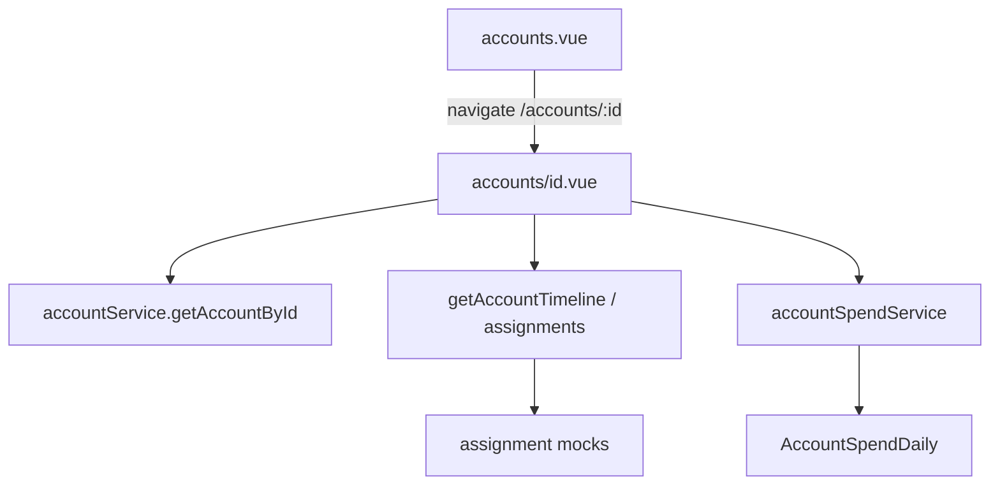

# Phase 3 — Account Detail

## 定位

| 来源 | 含义 |
|------|------|
| [plan.md](plan.md) §26 / STEP 3 | Account Detail：`/accounts/:id`、Header、KPI、Tabs、统一 Timeline |
| Phase 2 收尾建议 | 详情从 Modal 升级为独立页；Spend + Assignment 历史 |
| [phase_one.txt](phase_one.txt) | Phase 1 禁止「完整 Detail 页」——**Phase 3 正式做**；仍禁止 DB / 真实 Media API |

**默认范围（已选定）**：完整详情页 + 历史只读 API + Spend 区；Transfer/Recycle/Change* 仅 stub（与 Phase 2 一致，正式流转留给 STEP 8）。

## 现状与缺口

已有：

- 列表页 Modal 详情：[app/pages/accounts.vue](app/pages/accounts.vue) `openDetail`
- `accountService.getAccountById` → `AdAccountListItem`
- `accountSpendService.getAccountSpendMetrics` / `getAccountSpend`
- Mock 已含各类 Assignment 历史（[app/mocks/entities.ts](app/mocks/entities.ts)）

缺口：

- 无路由 `app/pages/accounts/[id].vue`
- Service 无 Timeline / 按账户拉全量历史的接口（mock 里只在 list 组装时取 `endedAt == null`）
- 无 Usage Days KPI；无 Tabs / Timeline UI

## 做 / 不做

**做**

1. 路由页 [`app/pages/accounts/[id].vue`](app/pages/accounts/[id].vue)
2. Domain 轻量只读模型：`AccountTimelineEvent`（及必要时 `AccountDetailBundle`）
3. `AccountService` 扩展（mock 实现）：
   - `getAccountTimeline(accountId)`
   - `getAccountAssignments(accountId)`（team/member 历史）
   - `getAccountManagerHistory` / `getAccountProductHistory` / `getAccountPlatformAssetHistory` / `getAccountChannelHistory` / `getAccountFeePolicyHistory`（或合并为一个 `getAccountRelationHistory` 返回分组）
4. Header + KPI + Tabs + Timeline（见下）
5. 列表「详情」/`externalAccountId` 点击 → `navigateTo(/accounts/${id})`；Transfer/Recycle 可留在列表或详情，仍 stub
6. 详情内复用 Period Spend 思路（metrics + custom range via `accountSpendService`）

**不做**

- Account Pool / Demand Scheduling / PostgreSQL / Media Connector
- 正式 `transferAccount` 等写操作与持久化
- 删除旧 Modal 组件逻辑以外的兼容层（Modal 可删或改为跳转前的短暂预览——**本阶段删除列表 Detail Modal，统一走路由**）
- API Data Tab 接真实同步（Tab 可占位「后续 Media Sync」）

## 页面信息架构（对齐 plan §26）

**Header**

- externalAccountId / accountName
- media / channel / platformAsset（动态 typeName）
- timezone
- current team / member / manager / product（+ customer 若 EXTERNAL）
- assetStatus / mediaStatus / apiAccessStatus
- note（若有）

**KPI**

- Today / 7D / 30D / Lifetime（`amountSpent`）
- Usage Days：`receivedAt`（或 first assignment `startedAt`）至 `MOCK_TODAY` 的日历天数
- Spend Limit / Remaining Limit（无 limit 显示 `—`）

**Tabs**

| Tab | 内容 |
|-----|------|
| Overview | 当前关系摘要 + 最近 Timeline 若干条 + Note |
| Spend | Period 选择 + metrics；可选简单按日表/聚合窗口；强调 Lifetime ≠ 含服务费 |
| Assignment | Team/Member 历史表（startedAt / endedAt / reason） |
| Product | Product + Fee Policy 历史 |
| Status | Asset/Media/API 当前态 + 说明（无独立 Status 变更事件 mock 时，从账户字段 + Timeline 中已有事件推导展示） |
| API Data | 占位：lastSyncAt / apiAccessStatus，文案标明未接 Media API |

**统一 Timeline**（只读，按时间倒序）

从各 Assignment + 账户 `receivedAt` / `createdAt` 合成事件类型：

- Imported（receivedAt）
- Assigned / Transferred（assignment 段，endedAt 非空可标 Transfer/Recycle 语义靠 reason）
- Product Changed / Manager Changed / Platform Asset Changed
- Channel / Fee Policy 变更（若有历史段）

单条：`at` / `type` / `title` / `description` / `actor?`

## 实现步骤

1. **Domain**：在 [app/domain/account.ts](app/domain/account.ts) 增加 `AccountTimelineEventType`、`AccountTimelineEvent`
2. **Service**：扩展 [types.ts](app/services/accounts/types.ts) + [mock.ts](app/services/accounts/mock.ts)；timeline 从现有 assignment 数组聚合，禁止页面直接扫 mock
3. **详情页**：新建 `app/pages/accounts/[id].vue`（可拆 `components/accounts/AccountDetailHeader.vue`、`AccountTimeline.vue`、`AccountSpendPanel.vue` 若单文件过大）
4. **列表改造**：[accounts.vue](app/pages/accounts.vue) 详情入口改为路由；移除 `showDetailModal` 及相关模板
5. **空态/404**：id 不存在时展示空态 + 返回列表
6. **验收**：CASE D（张三/李四分离）、CASE E spend KPI、CASE H note；含 Snapchat 账户可打开；Timeline 至少含 Import + 一段 Assignment 历史（如 `acc-case-d`）
7. **收尾**：详情相关 typecheck；输出 Phase 3 Completed + Proposed Phase 4（Account Pool）计划，不实施

## 关键文件

| 动作 | 路径 |
|------|------|
| 新建 | `app/pages/accounts/[id].vue` |
| 可选新建 | `app/components/accounts/AccountDetailHeader.vue`、`AccountTimeline.vue`、`AccountSpendPanel.vue` |
| 修改 | `app/domain/account.ts`、`app/services/accounts/types.ts`、`app/services/accounts/mock.ts`、`app/pages/accounts.vue` |
| 不动 | `server/api/**`、渠道/团队页、DB |

## 风险（记入，不全清债）

- Timeline 事件类型靠 mock reason/字段推断，可能与未来真实事件表不完全一致 → Domain Freeze 前再校准
- Usage Days 定义（receivedAt vs firstSeenAt）需在实现时固定为 **receivedAt → MOCK_TODAY**，并在 Technical Debt 注明
- Transfer stub 仍 OPEN（原 R07）
